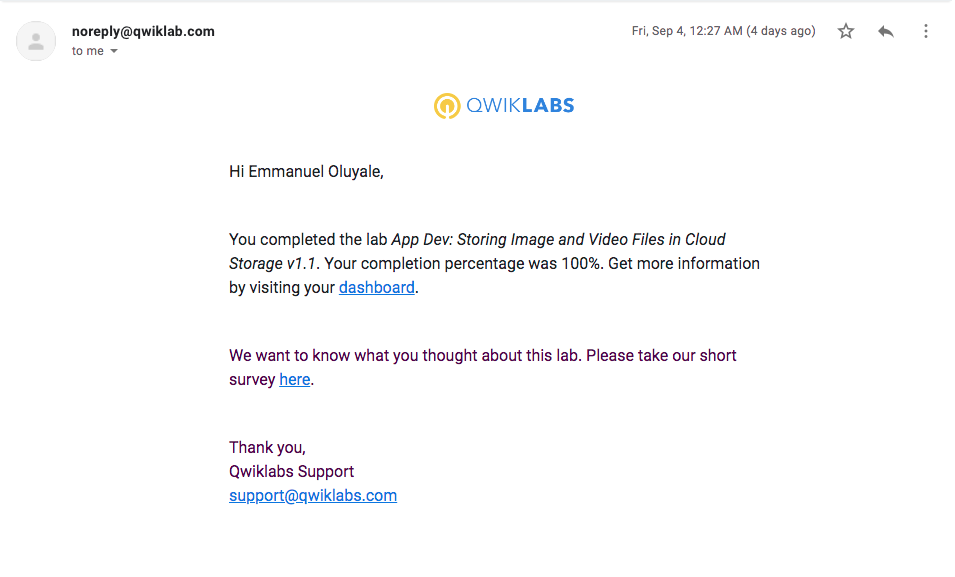

# gadsProject

## QwikLabs Completed

  
Lab 01: App Dev: Setting up a Development Environment

  

  
Lab 02: App Dev: Storing Image and Video Files in the Cloud

  

  
Lab 03: Explore a BigQuery Public Dataset

  

  
Lab 04: Google Cloud Fundamentals: Getting Started with Cloud Marketplace

  

  
Lab 05: Google Cloud Fundamentals: Getting Started with App Engine

  

  
Lab 06: Google Cloud Fundamentals: Getting Started with Deployment Manager and Cloud Monitoring

  

  
Lab 07: Google Cloud Fundamentals: Getting Started with BigQuery

  

  
Lab 08: Google Cloud Fundamentals: Getting Started with Compute Engine

  

